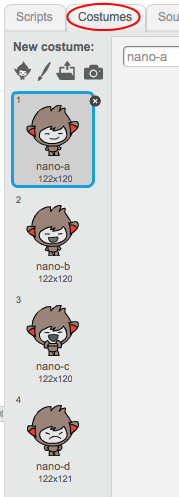

## Step 3: Making decisions

You can program your chatbot to decide what to say or do based on your responses to its questions.

+ Can you make the chatbot ask the question "Are you OK?", and code it to reply "That's great to hear!" only __if__ the user answers "yes"?

    To test your new code properly, you should test it __twice__, once with the answer "yes", and once with the answer "no".

    Your chatbot should reply "That's great to hear!" if you answer "yes", but say nothing if you answer "no".

    

--- hints ---
--- hint ---
After your chatbot has said "Hi", it should now also __ask__ "Are you OK?". __If__ you answer "yes", then the chatbot should __say__ "That's great to hear!".
--- /hint ---
--- hint ---
Here are the extra code blocks you'll need:

--- /hint ---
--- hint ---
Here's how your code should look:

--- /hint ---
--- /hints ---

+ The trouble with your chatbot is that it doesn't reply if you answer "no". Can you change your chatbot so that it also replies "Oh no!" if you answer "no" to its question?

    Test and save: Your chatbot should now say "Oh no!" if you answer "no". In fact, it will say "On no!" if you answer with anything other than "yes" (the __else__ in an if/else block means __otherwise__).

    

--- hints ---
--- hint ---
Your ChatBot should now say "That's great to hear!" __if__ your answer is "yes", but should say "Oh no!" if you answer with something __else__.
--- /hint ---
--- hint ---
Here are the code blocks you'll need to use:

--- /hint ---
--- hint ---
Here's how your code should look:

--- /hint ---
--- /hints ---

+ You can put any code inside an `if` or `else` block, not just code to make your chatbot speak. If you click your chatbot's **Costume** tab, you'll see that it has more than one.

    

+ Can you change the chatbot's costume to match your response?

    Test and save: You should see your chatbot's face change depending on your answer.

    

--- hints ---
--- hint ---
Your chatbot should now also __switch costume__ depending on the answer given.
--- /hint ---
--- hint ---
Here are the code blocks you'll need to use:

--- /hint ---
--- hint ---
Here's how your code should look:

--- /hint ---
--- /hints ---

+ Have you noticed that your chatbot's costume stays the one it changed to the last time you spoke to it? Can you fix this problem?

    

    Test and save: Run your code and type "no", so that your chatbot looks unhappy. When you run your code again, your chatbot should change back to a smiling face before asking your name.

    

--- hints ---
--- hint ---
When the __sprite is clicked__, your chatbot should first __switch costume__ to a smiling face.
--- /hint ---
--- hint ---
Here's the code block you'll need to add:

--- /hint ---
--- hint ---
Here's how your code should look:

--- /hint ---
--- /hints ---

--- challenge ---
## Challenge: more decisions

Program your chatbot to ask another question - something with a "yes" or "no" answer. Can you make your chatbot respond to the answer?

--- /challenge ---
